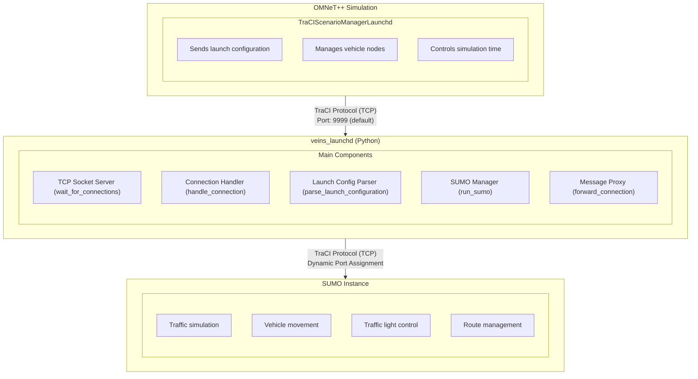
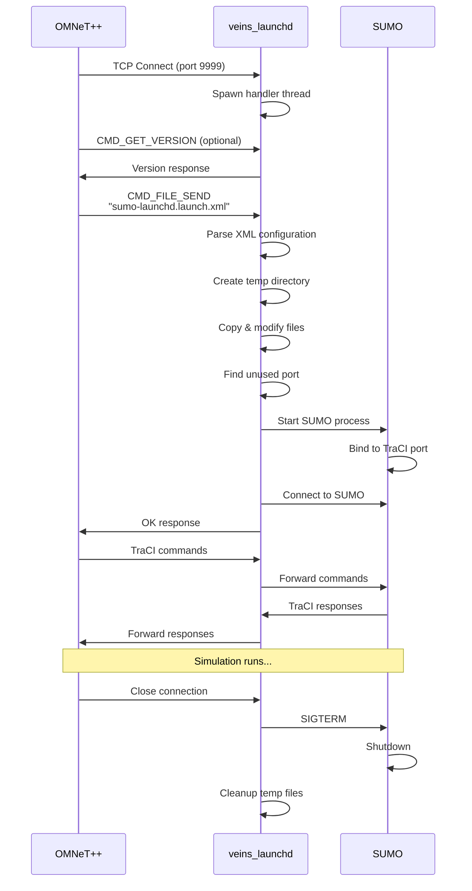
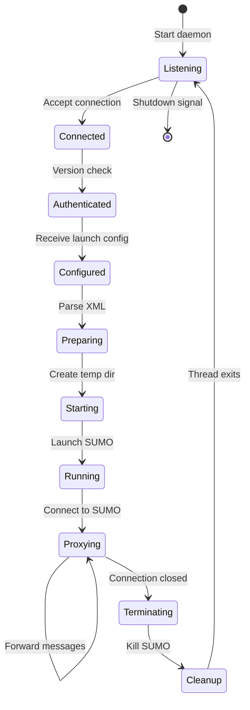
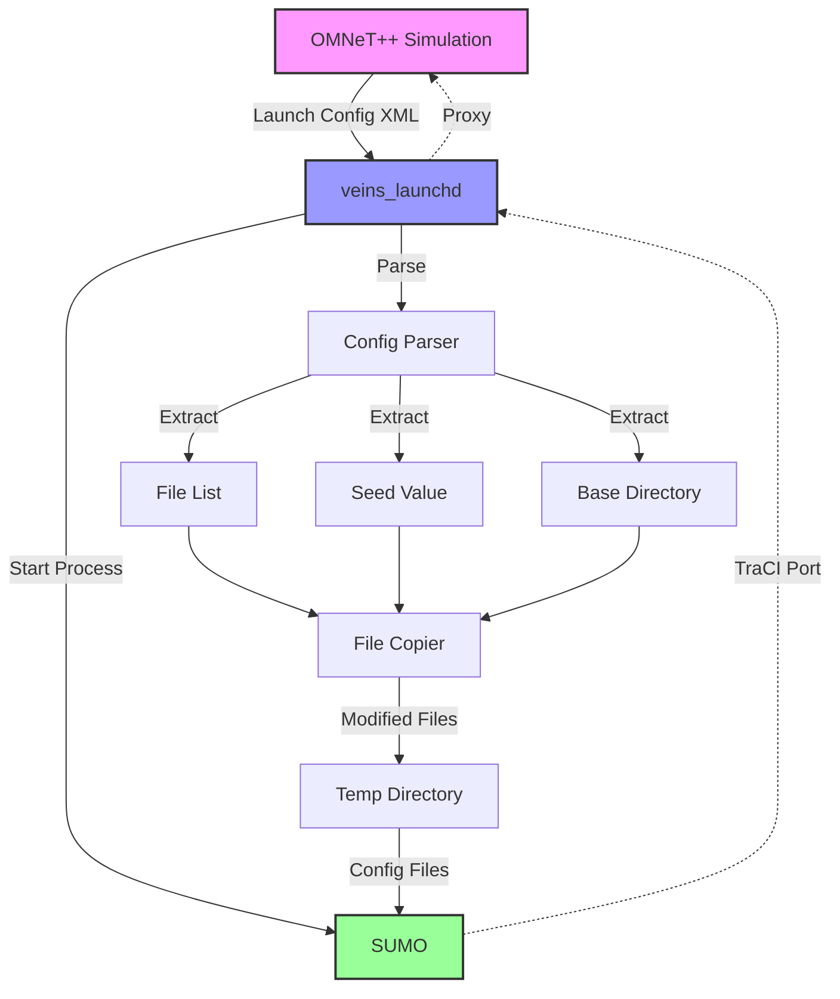

# Veins_launchd Technical Documentation

## Complete Architecture and Implementation Guide

> **Version:** 1.0
> **Last Updated:** December 2024
> **Purpose:** Comprehensive technical reference for understanding, using, and extending veins_launchd

---

## Table of Contents

1. [Executive Summary](#executive-summary)
2. [High-Level Architecture](#high-level-architecture)
3. [System Components](#system-components)
4. [Execution Flow](#execution-flow)
5. [Function Reference](#function-reference)
6. [Module & Class Breakdown](#module--class-breakdown)
7. [Configuration & Environment](#configuration--environment)
8. [Common Usage Patterns](#common-usage-patterns)
9. [Technical Diagrams](#technical-diagrams)
10. [Troubleshooting Guide](#troubleshooting-guide)
11. [Cross-References](#cross-references)

---

## Executive Summary

`veins_launchd` is a Python-based daemon that acts as a critical bridge between OMNeT++ network simulations and SUMO traffic simulations in the Veins framework. It manages the lifecycle of SUMO instances, handles TraCI (Traffic Control Interface) protocol communications, and ensures proper resource allocation for parallel simulations.

### Key Responsibilities:

- **SUMO Instance Management**: Spawns and controls SUMO processes on-demand
- **TraCI Proxy**: Bidirectional message forwarding between OMNeT++ and SUMO
- **Resource Allocation**: Dynamic port assignment and temporary directory management
- **Configuration Processing**: XML-based launch configuration handling
- **Connection Management**: Multi-threaded TCP server for handling concurrent simulations

---

## High-Level Architecture

<details>
<summary><b>📊 System Overview (Click to expand)</b></summary>

### Component Interaction Model



### Key Design Principles

1. **Separation of Concerns**: Network simulation (OMNeT++) is decoupled from traffic simulation (SUMO)
2. **Scalability**: Multi-threaded design supports concurrent simulations
3. **Resource Isolation**: Each simulation runs in its own temporary directory
4. **Protocol Transparency**: Acts as a transparent proxy for TraCI messages
5. **Fault Tolerance**: Graceful handling of connection failures and SUMO crashes

</details>

---

## System Components

<details>
<summary><b>🔧 Core Components Breakdown (Click to expand)</b></summary>

### 1. TCP Socket Server

**Location:** `wait_for_connections()` function
**Purpose:** Main entry point that listens for incoming connections

```python
def wait_for_connections(sumo_command, shlex, sumo_port, bind_address,
                        do_daemonize, do_kill, pidfile, keep_temp):
    """
    Open TCP socket, wait for connections, call handle_connection for each
    """
```

**Key Features:**

- Binds to configurable address/port (default: 127.0.0.1:9999)
- Supports daemon mode for background execution
- Handles multiple concurrent connections via threading
- Graceful shutdown on SIGTERM/SIGINT

### 2. Connection Handler

**Location:** `handle_connection()` function
**Purpose:** Manages individual client connections

```python
def handle_connection(sumo_command, shlex, conn, addr, keep_temp):
    """
    Handle incoming connection.
    """
```

**Workflow:**

1. Reads launch configuration from client
2. Processes configuration
3. Spawns SUMO instance
4. Establishes proxy connection

### 3. Launch Configuration Parser

**Location:** `parse_launch_configuration()` function
**Purpose:** Extracts settings from XML configuration

```python
def parse_launch_configuration(launch_xml_string):
    """
    Returns tuple of options set in launch configuration
    """
```

**Parsed Elements:**

- `<basedir>`: Base directory for simulation files
- `<seed>`: Random seed for reproducibility
- `<copy>`: Files to copy to temporary directory

### 4. SUMO Process Manager

**Location:** `run_sumo()` function
**Purpose:** Spawns and manages SUMO subprocess

```python
def run_sumo(runpath, sumo_command, shlex, config_file_name,
            remote_port, seed, client_socket, unused_port_lock, keep_temp):
    """
    Actually run SUMO.
    """
```

**Responsibilities:**

- Creates log files for SUMO output
- Starts SUMO subprocess with proper configuration
- Establishes connection to SUMO's TraCI server
- Manages SUMO lifecycle (including termination)

### 5. Message Proxy

**Location:** `forward_connection()` function
**Purpose:** Bidirectional message forwarding

```python
def forward_connection(client_socket, server_socket, process):
    """
    Proxy connections until either socket runs out of data or process terminates.
    """
```

**Features:**

- Uses `select()` for efficient I/O multiplexing
- TCP_NODELAY for low-latency forwarding
- Handles connection failures gracefully

</details>

---

## Execution Flow

<details>
<summary><b>🔄 Step-by-Step Execution Flow (Click to expand)</b></summary>

### Phase 1: Initialization

1. **Daemon Startup**

   ```bash
   ./bin/veins_launchd -vv -p 9999
   ```

   - Parses command-line arguments
   - Configures logging
   - Opens TCP socket on specified port

2. **Socket Binding**
   - Creates socket with SO_REUSEADDR option
   - Binds to specified address/port
   - Starts listening for connections

### Phase 2: Connection Establishment

3. **Client Connection**

   - OMNeT++ simulation connects via TraCIScenarioManagerLaunchd
   - New thread spawned for each connection
   - Connection details logged

4. **Protocol Handshake**
   - Client may send CMD_GET_VERSION (0x00)
   - Server responds with API version info
   - Establishes protocol compatibility

### Phase 3: Configuration Reception

5. **Launch Configuration**

   - Client sends CMD_FILE_SEND (0x75) command
   - Contains "sumo-launchd.launch.xml" file
   - XML parsed for simulation parameters

6. **Configuration Processing**
   ```xml
   <?xml version="1.0"?>
   <launch>
     <basedir path="/path/to/simulation" />
     <seed value="1234" />
     <copy file="network.net.xml" />
     <copy file="routes.rou.xml" />
     <copy file="sumo.sumo.cfg" type="config" />
   </launch>
   ```

### Phase 4: SUMO Preparation

7. **Temporary Directory Creation**

   - Creates isolated workspace (prefix: "sumo-launchd-tmp-")
   - Copies specified files from basedir
   - Modifies SUMO config with dynamic port and seed

8. **Port Allocation**
   - Acquires lock on unused port finder
   - Finds available port for SUMO TraCI server
   - Updates configuration with port number

### Phase 5: SUMO Execution

9. **Process Launch**

   - Spawns SUMO subprocess
   - Redirects stdout/stderr to log files
   - Waits for SUMO to bind to TraCI port

10. **Connection to SUMO**
    - Attempts connection with exponential backoff
    - Maximum 10 retry attempts
    - Releases port lock after successful connection

### Phase 6: Proxy Mode

11. **Message Forwarding**
    - Enters bidirectional proxy mode
    - Forwards all TraCI messages between client and SUMO
    - Continues until connection closes or SUMO terminates

### Phase 7: Cleanup

12. **Termination**

    - Sends SIGTERM to SUMO process
    - Escalates to SIGKILL if necessary
    - Closes all sockets

13. **Resource Cleanup**
    - Removes temporary directory (unless --keep-temp)
    - Writes result XML with execution status
    - Thread exits

</details>

---

## Function Reference

<details>
<summary><b>📚 Detailed Function Documentation (Click to expand)</b></summary>

### Core Functions

#### `main()`

**Purpose:** Program entry point
**Parameters:** None (uses command-line arguments)
**Returns:** None
**Dependencies:** optparse, logging, signal

**Functionality:**

- Parses command-line options
- Sets up logging configuration
- Installs signal handlers
- Calls `wait_for_connections()`

---

#### `wait_for_connections(sumo_command, shlex, sumo_port, bind_address, do_daemonize, do_kill, pidfile, keep_temp)`

**Purpose:** Main server loop that accepts connections
**Parameters:**

- `sumo_command` (str): Command to execute SUMO
- `shlex` (bool): Whether to use shell parsing for command
- `sumo_port` (int): Port to listen on
- `bind_address` (str): IP address to bind to
- `do_daemonize` (bool): Run as daemon
- `do_kill` (bool): Kill existing daemon first
- `pidfile` (str): Path to PID file
- `keep_temp` (bool): Preserve temporary directories

**Returns:** None
**Dependencies:** socket, start_new_thread
**Error Handling:** Catches SystemExit, KeyboardInterrupt

---

#### `handle_connection(sumo_command, shlex, conn, addr, keep_temp)`

**Purpose:** Handles individual client connection
**Parameters:**

- `sumo_command` (str): SUMO executable command
- `shlex` (bool): Shell parsing flag
- `conn` (socket): Client socket connection
- `addr` (tuple): Client address (IP, port)
- `keep_temp` (bool): Preserve temp files flag

**Returns:** None
**Dependencies:** `read_launch_config()`, `handle_launch_configuration()`
**Error Handling:** Logs exceptions, ensures socket closure

---

#### `read_launch_config(conn)`

**Purpose:** Reads launch configuration from socket
**Parameters:**

- `conn` (socket): Client connection

**Returns:** str - Launch configuration XML
**Dependencies:** struct, socket
**Protocol Details:**

- Expects TraCI message format
- Handles CMD_GET_VERSION gracefully
- Validates CMD_FILE_SEND command

---

#### `parse_launch_configuration(launch_xml_string)`

**Purpose:** Parses XML launch configuration
**Parameters:**

- `launch_xml_string` (str): XML configuration string

**Returns:** tuple(basedir, copy_nodes, seed)
**Dependencies:** xml.dom.minidom
**Validation:**

- Checks for valid root element
- Ensures single basedir/seed nodes
- Default seed: 23423

---

#### `handle_launch_configuration(sumo_command, shlex, launch_xml_string, client_socket, keep_temp)`

**Purpose:** Processes complete launch configuration
**Parameters:**

- `sumo_command` (str): SUMO command
- `shlex` (bool): Shell parsing flag
- `launch_xml_string` (str): XML configuration
- `client_socket` (socket): Client connection
- `keep_temp` (bool): Preserve temp files

**Returns:** str - Result XML with execution status
**Dependencies:** tempfile, shutil
**Workflow:**

1. Creates temporary directory
2. Parses configuration
3. Finds unused port
4. Copies/modifies files
5. Runs SUMO
6. Cleans up resources

---

#### `run_sumo(runpath, sumo_command, shlex, config_file_name, remote_port, seed, client_socket, unused_port_lock, keep_temp)`

**Purpose:** Executes SUMO subprocess
**Parameters:**

- `runpath` (str): Temporary directory path
- `sumo_command` (str): SUMO executable
- `shlex` (bool): Use shell parsing
- `config_file_name` (str): SUMO config filename
- `remote_port` (int): Port for SUMO TraCI
- `seed` (int): Random seed
- `client_socket` (socket): Client connection
- `unused_port_lock` (UnusedPortLock): Port allocation lock
- `keep_temp` (bool): Preserve temp files

**Returns:** str - Result XML
**Dependencies:** subprocess, time, signal
**Error Handling:**

- OSError for process spawn failures
- socket.error for connection issues
- Timeout handling for SUMO termination

---

#### `forward_connection(client_socket, server_socket, process)`

**Purpose:** Proxies messages between client and SUMO
**Parameters:**

- `client_socket` (socket): OMNeT++ connection
- `server_socket` (socket): SUMO connection
- `process` (Popen): SUMO subprocess

**Returns:** None
**Dependencies:** select, socket
**Features:**

- Bidirectional forwarding
- Non-blocking I/O
- TCP_NODELAY for low latency

---

#### `copy_and_modify_files(basedir, copy_nodes, runpath, remote_port, seed)`

**Purpose:** Copies simulation files to temp directory
**Parameters:**

- `basedir` (str): Source directory
- `copy_nodes` (list): XML nodes describing files
- `runpath` (str): Destination directory
- `remote_port` (int): SUMO TraCI port
- `seed` (int): Random seed

**Returns:** str - Config filename
**Dependencies:** xml.dom.minidom, os
**Modifications:**

- Sets remote-port in config
- Sets seed value
- Disables random mode

---

#### `find_unused_port()`

**Purpose:** Finds available TCP port
**Parameters:** None
**Returns:** int - Available port number
**Dependencies:** socket
**Method:** Binds to port 0, lets OS assign

---

#### `daemonize(pidfile)`

**Purpose:** Detaches process to run as daemon
**Parameters:**

- `pidfile` (str): Path to PID file

**Returns:** None
**Dependencies:** os, sys, atexit
**Process:**

1. Double fork to prevent zombies
2. Creates new session
3. Writes PID file
4. Registers cleanup handler

### Helper Classes

#### `UnusedPortLock`

**Purpose:** Thread-safe port allocation
**Methods:**

- `acquire()`: Obtains lock
- `release()`: Releases lock
- `__enter__()/__exit__()`: Context manager support

**Class Variable:**

- `lock`: Shared thread lock

</details>

---

## Module & Class Breakdown

<details>
<summary><b>🏗️ OMNeT++ Integration Components (Click to expand)</b></summary>

### TraCIScenarioManagerLaunchd (C++)

**Location:** `src/veins/modules/mobility/traci/`

#### Class Hierarchy

```
TraCIScenarioManager
    └── TraCIScenarioManagerLaunchd
```

#### Key Methods

##### `initialize(int stage)`

**Purpose:** OMNeT++ initialization hook
**Functionality:**

- Reads launchConfig parameter from omnetpp.ini
- Sets default basedir to network file location
- Configures seed from simulation run number

##### `init_traci()`

**Purpose:** Establishes TraCI connection
**Workflow:**

1. Checks API version compatibility
2. Sends launch configuration via CMD_FILE_SEND
3. Waits for acknowledgment
4. Calls parent class initialization

#### Configuration Parameters

**omnetpp.ini settings:**

```ini
*.manager.host = "localhost"
*.manager.port = 9999
*.manager.launchConfig = xmldoc("erlangen.launchd.xml")
*.manager.autoShutdown = true
*.manager.updateInterval = 1s
```

### TraCI Protocol Constants

**Location:** `src/veins/modules/mobility/traci/TraCIConstants.h`

```cpp
namespace TraCIConstants {
    const uint8_t CMD_FILE_SEND = 0x75;
    const uint8_t CMD_GET_VERSION = 0x00;
    const uint8_t RTYPE_OK = 0x00;
    const uint8_t RTYPE_NOTIMPLEMENTED = 0x01;
}
```

### Message Format

#### TraCI Message Structure

```
┌────────────┬────────────┬────────────┬──────────────┐
│ Msg Length │ Cmd Length │ Command ID │ Command Data │
│  (4 bytes) │  (1 byte)  │  (1 byte)  │  (variable)  │
└────────────┴────────────┴────────────┴──────────────┘
```

#### CMD_FILE_SEND Payload

```
┌──────────────┬──────────────┬──────────────┬──────────────┐
│ Filename Len │   Filename   │  Data Length │     Data     │
│   (4 bytes)  │  (variable)  │   (4 bytes)  │  (variable)  │
└──────────────┴──────────────┴──────────────┴──────────────┘
```

</details>

---

## Configuration & Environment

<details>
<summary><b>⚙️ Configuration Requirements (Click to expand)</b></summary>

### Command-Line Options

```bash
veins_launchd [options]

Options:
  -h, --help            Show help message and exit
  -c COMMAND, --command=COMMAND
                        Run SUMO as COMMAND [default: sumo]
  -s, --shlex           Treat command as shell string, replace {} with params
  -p PORT, --port=PORT  Listen for connections on PORT [default: 9999]
  -b ADDRESS, --bind=ADDRESS
                        Bind to ADDRESS [default: 127.0.0.1]
  -L LOGFILE, --logfile=LOGFILE
                        Log messages to LOGFILE [default: /tmp/sumo-launchd.log]
  -v, --verbose         Increase verbosity (can be used multiple times)
  -q, --quiet           Decrease verbosity
  -d, --daemon          Detach and run as daemon
  -k, --kill            Send SIGTERM to running daemon first
  -P PIDFILE, --pidfile=PIDFILE
                        PID file location [default: /tmp/sumo-launchd.pid]
  -t, --keep-temp       Keep all temporary files
```

### Environment Variables

| Variable    | Purpose                           | Default      |
| ----------- | --------------------------------- | ------------ |
| `PATH`      | Must include SUMO binary location | System PATH  |
| `SUMO_HOME` | SUMO installation directory       | Not required |
| `TMPDIR`    | Temporary file location           | `/tmp`       |

### Launch Configuration XML Schema

```xml
<?xml version="1.0"?>
<launch>
    <!-- Optional: Base directory for files -->
    <basedir path="/absolute/path/to/files" />

    <!-- Optional: Random seed (default: 23423) -->
    <seed value="12345" />

    <!-- Required: Files to copy -->
    <copy file="network.net.xml" />
    <copy file="routes.rou.xml" />
    <copy file="additional.xml" />

    <!-- Required: SUMO configuration (must have type="config") -->
    <copy file="simulation.sumo.cfg" type="config" />
</launch>
```

### SUMO Configuration Modifications

The daemon automatically modifies the SUMO configuration:

```xml
<!-- Added/Modified by veins_launchd -->
<remote-port value="[dynamic_port]" />
<seed value="[specified_seed]" />
<random value="false" />
```

### Directory Structure

```
/tmp/sumo-launchd-tmp-XXXXXX/
├── network.net.xml           # Network topology
├── routes.rou.xml            # Vehicle routes
├── simulation.sumo.cfg       # Modified config
├── sumo-launchd.out.log     # SUMO stdout
└── sumo-launchd.err.log     # SUMO stderr
```

### Logging Configuration

**Log Levels:**

- ERROR: Critical failures only
- WARN: Warnings and errors (default)
- INFO: General information (-v)
- DEBUG: Detailed debugging (-vv)

**Log Format:**

```
[TIMESTAMP] [LEVEL] [MODULE] Message
```

</details>

---

## Common Usage Patterns

<details>
<summary><b>💡 Examples and Best Practices (Click to expand)</b></summary>

### Basic Usage

#### 1. Starting the Daemon

```bash
# Foreground mode with verbose logging
./bin/veins_launchd -vv

# Background daemon mode
./bin/veins_launchd -d

# Custom port and logging
./bin/veins_launchd -p 8888 -L /var/log/veins.log -v
```

#### 2. OMNeT++ Configuration

```ini
[General]
*.manager.moduleType = "TraCIScenarioManagerLaunchd"
*.manager.host = "localhost"
*.manager.port = 9999
*.manager.launchConfig = xmldoc("launch.xml")
```

#### 3. Launch Configuration Examples

**Simple Configuration:**

```xml
<?xml version="1.0"?>
<launch>
    <copy file="simple.net.xml" />
    <copy file="simple.rou.xml" />
    <copy file="simple.sumo.cfg" type="config" />
</launch>
```

**Complex Configuration with Custom Paths:**

```xml
<?xml version="1.0"?>
<launch>
    <basedir path="/home/user/simulations/urban" />
    <seed value="42" />
    <copy file="manhattan.net.xml" />
    <copy file="traffic.rou.xml" />
    <copy file="pedestrians.rou.xml" />
    <copy file="tls.add.xml" />
    <copy file="urban.sumo.cfg" type="config" />
</launch>
```

### Advanced Patterns

#### Running Multiple Simulations

```bash
# Start multiple daemons on different ports
./bin/veins_launchd -p 9999 -P /tmp/veins1.pid &
./bin/veins_launchd -p 9998 -P /tmp/veins2.pid &
```

#### Using Custom SUMO Binaries

```bash
# Use specific SUMO version
./bin/veins_launchd -c /opt/sumo-1.8.0/bin/sumo

# Use SUMO-GUI for debugging
./bin/veins_launchd -c sumo-gui

# Use shell command with parameters
./bin/veins_launchd -s -c "sumo --step-length 0.1 {}"
```

#### Debugging Failed Simulations

```bash
# Keep temporary files for inspection
./bin/veins_launchd -vv --keep-temp

# Check logs after failure
tail -f /tmp/sumo-launchd.log
ls -la /tmp/sumo-launchd-tmp-*/
cat /tmp/sumo-launchd-tmp-*/sumo-launchd.err.log
```

### Performance Optimization

#### 1. Connection Pooling

- Reuse daemon instance for multiple simulations
- Reduces startup overhead

#### 2. Resource Limits

```bash
# Increase file descriptor limit
ulimit -n 4096

# Set process priority
nice -n -5 ./bin/veins_launchd
```

#### 3. Network Optimization

- Use localhost for same-machine setups
- Consider Unix domain sockets for future versions

### Security Considerations

#### 1. Bind to Localhost Only

```bash
# Secure: Local connections only
./bin/veins_launchd -b 127.0.0.1

# Insecure: Accepts remote connections
./bin/veins_launchd -b 0.0.0.0  # AVOID!
```

#### 2. File System Permissions

```bash
# Set restrictive permissions on temp directory
export TMPDIR=/secure/tmp
chmod 700 /secure/tmp
```

#### 3. Process Isolation

- Run as non-root user
- Use separate user for production

</details>

---

## Technical Diagrams

<details>
<summary><b>📈 Sequence and Flow Diagrams (Click to expand)</b></summary>

### Connection Establishment Sequence



### State Machine Diagram



### Data Flow Diagram



### Component Interaction Timeline

```
Time →
│
├─ T0: Daemon startup
│  └─ Socket bind on port 9999
│
├─ T1: Client connection
│  ├─ Thread spawn
│  └─ Socket accept
│
├─ T2: Configuration reception
│  ├─ Read TraCI message
│  └─ Parse XML
│
├─ T3: Resource allocation
│  ├─ Create temp directory
│  ├─ Copy files
│  └─ Find free port
│
├─ T4: SUMO launch
│  ├─ Spawn subprocess
│  └─ Wait for TraCI bind
│
├─ T5: Proxy establishment
│  ├─ Connect to SUMO
│  └─ Enter forwarding loop
│
├─ T6: Simulation execution
│  └─ Bidirectional message flow
│
├─ T7: Termination
│  ├─ Client disconnect
│  ├─ SUMO shutdown
│  └─ Resource cleanup
│
└─ T8: Ready for next connection
```

</details>

---

## Troubleshooting Guide

<details>
<summary><b>🔧 Common Issues and Solutions (Click to expand)</b></summary>

### Connection Issues

#### Problem: "Connection refused" error

**Symptoms:**

```
Error: Connection to TraCI server refused
```

**Solutions:**

1. Check daemon is running: `ps aux | grep veins_launchd`
2. Verify port: `netstat -an | grep 9999`
3. Check firewall: `sudo iptables -L`
4. Start daemon: `./bin/veins_launchd -vv`

#### Problem: "Address already in use"

**Symptoms:**

```
OSError: [Errno 98] Address already in use
```

**Solutions:**

1. Kill existing daemon: `./bin/veins_launchd -k`
2. Find process: `lsof -i :9999`
3. Use different port: `./bin/veins_launchd -p 9998`

### SUMO Launch Issues

#### Problem: SUMO fails to start

**Symptoms:**

```
Could not start SUMO: [Errno 2] No such file or directory
```

**Solutions:**

1. Check SUMO installation: `which sumo`
2. Specify full path: `-c /usr/local/bin/sumo`
3. Verify PATH: `echo $PATH`
4. Install SUMO: `apt-get install sumo`

#### Problem: SUMO crashes immediately

**Symptoms:**

```
Exited with error code 1
Check sumo-launchd.err.log
```

**Solutions:**

1. Keep temp files: `--keep-temp`
2. Check error log: `/tmp/sumo-launchd-tmp-*/sumo-launchd.err.log`
3. Validate network file: `sumo --net-file network.net.xml`
4. Check routes: `sumo --route-files routes.rou.xml`

### Configuration Issues

#### Problem: Invalid launch configuration

**Symptoms:**

```
RuntimeError: launch config root element not <launch>
```

**Solutions:**

1. Validate XML syntax
2. Check root element is `<launch>`
3. Ensure config file has `type="config"`
4. Verify file paths exist

#### Problem: Files not found

**Symptoms:**

```
RuntimeError: file "network.net.xml" does not exist
```

**Solutions:**

1. Check basedir setting
2. Use absolute paths
3. Verify file permissions
4. Check working directory

### Performance Issues

#### Problem: Slow simulation startup

**Symptoms:**

- Long delay before simulation starts
- High CPU usage during initialization

**Solutions:**

1. Reduce file sizes
2. Use binary formats
3. Increase connection timeout
4. Profile with `--keep-temp`

#### Problem: Message forwarding lag

**Symptoms:**

- Delayed vehicle updates
- Choppy movement

**Solutions:**

1. Check network latency
2. Disable Nagle: TCP_NODELAY is set
3. Increase socket buffer size
4. Use localhost instead of IP

### Debug Techniques

#### Enable Maximum Logging

```bash
./bin/veins_launchd -vv -L debug.log --keep-temp
```

#### Monitor in Real-Time

```bash
tail -f /tmp/sumo-launchd.log
strace -p $(pidof python3)
tcpdump -i lo port 9999
```

#### Analyze Temp Directory

```bash
find /tmp/sumo-launchd-tmp-* -type f -exec ls -la {} \;
grep ERROR /tmp/sumo-launchd-tmp-*/sumo-launchd.err.log
```

</details>

---

## Cross-References

<details>
<summary><b>🔗 Related Documentation and Resources (Click to expand)</b></summary>

### Internal References

#### Veins Components

- [TraCIScenarioManager](src/veins/modules/mobility/traci/TraCIScenarioManager.h) - Base class for TraCI management
- [TraCIConnection](src/veins/modules/mobility/traci/TraCIConnection.h) - Low-level TraCI protocol handling
- [TraCICommandInterface](src/veins/modules/mobility/traci/TraCICommandInterface.h) - High-level TraCI commands
- [TraCIConstants](src/veins/modules/mobility/traci/TraCIConstants.h) - Protocol constants and definitions

#### Example Configurations

- [erlangen.launchd.xml](examples/veins/erlangen.launchd.xml) - Sample launch configuration
- [omnetpp.ini](examples/veins/omnetpp.ini) - OMNeT++ configuration example
- [RSUExampleScenario.ned](examples/veins/RSUExampleScenario.ned) - Network description

### External References

#### SUMO Documentation

- [TraCI Protocol Specification](https://sumo.dlr.de/docs/TraCI/Protocol.html)
- [SUMO Configuration](https://sumo.dlr.de/docs/sumo.html)
- [Network Building](https://sumo.dlr.de/docs/Networks/PlainXML.html)

#### OMNeT++ Resources

- [OMNeT++ Manual](https://omnetpp.org/documentation/)
- [NED Language](https://doc.omnetpp.org/omnetpp/manual/#cha:ned-lang)
- [Configuration Reference](https://doc.omnetpp.org/omnetpp/manual/#cha:config-reference)

#### Veins Documentation

- [Official Website](http://veins.car2x.org/)
- [Veins Tutorial](http://veins.car2x.org/tutorial/)
- [API Documentation](http://veins.car2x.org/documentation/)

### Related Papers

1. **"Bidirectionally Coupled Network and Road Traffic Simulation for Improved IVC Analysis"**

   - Sommer, C., German, R., & Dressler, F. (2011)
   - IEEE Transactions on Mobile Computing

2. **"Veins: The Open Source Vehicular Network Simulation Framework"**
   - Sommer, C., et al. (2019)
   - Recent Advances in Network Simulation

### Community Resources

- [Veins Mailing List](http://veins.car2x.org/support/)
- [GitHub Repository](https://github.com/sommer/veins)
- [Stack Overflow Tag](https://stackoverflow.com/questions/tagged/veins)

</details>

---

## Appendix: Quick Reference Card

<details>
<summary><b>📋 Command Cheat Sheet (Click to expand)</b></summary>

### Essential Commands

```bash
# Start daemon (foreground, verbose)
./bin/veins_launchd -vv

# Start daemon (background)
./bin/veins_launchd -d

# Stop daemon
./bin/veins_launchd -k

# Custom configuration
./bin/veins_launchd -p 8888 -c sumo-gui -vv --keep-temp

# Check status
ps aux | grep veins_launchd
netstat -tlnp | grep 9999
tail -f /tmp/sumo-launchd.log
```

### Configuration Templates

**Minimal launch.xml:**

```xml
<?xml version="1.0"?>
<launch>
    <copy file="network.net.xml" />
    <copy file="routes.rou.xml" />
    <copy file="config.sumo.cfg" type="config" />
</launch>
```

**Full launch.xml:**

```xml
<?xml version="1.0"?>
<launch>
    <basedir path="/path/to/files" />
    <seed value="12345" />
    <copy file="network.net.xml" />
    <copy file="routes.rou.xml" />
    <copy file="additional.xml" />
    <copy file="config.sumo.cfg" type="config" />
</launch>
```

**OMNeT++ Configuration:**

```ini
*.manager.moduleType = "org.car2x.veins.modules.mobility.traci.TraCIScenarioManagerLaunchd"
*.manager.updateInterval = 0.1s
*.manager.host = "localhost"
*.manager.port = 9999
*.manager.autoShutdown = true
*.manager.launchConfig = xmldoc("launch.xml")
```

### Debugging Workflow

1. **Enable verbose logging:** `-vv`
2. **Keep temporary files:** `--keep-temp`
3. **Check daemon log:** `/tmp/sumo-launchd.log`
4. **Check SUMO logs:** `/tmp/sumo-launchd-tmp-*/sumo-launchd.*.log`
5. **Validate configuration:** `xmllint --noout launch.xml`
6. **Test SUMO directly:** `sumo -c config.sumo.cfg`

</details>

---

## Contributing & Development

<details>
<summary><b>👥 Development Guidelines (Click to expand)</b></summary>

### Code Style

- Python 3 compatible
- PEP 8 compliance
- Comprehensive docstrings
- Type hints (future enhancement)

### Testing

```bash
# Unit tests (to be added)
python -m pytest tests/

# Integration test
./test_veins_launchd.sh
```

### Future Enhancements

1. **WebSocket support** for browser-based clients
2. **REST API** for configuration management
3. **Metrics collection** for performance monitoring
4. **Docker container** for isolated execution
5. **Kubernetes operator** for cloud deployment

### Contributing Process

1. Fork repository
2. Create feature branch
3. Write tests
4. Submit pull request
5. Update documentation

</details>

---

_This documentation is part of the Veins framework. For questions and support, visit [veins.car2x.org](http://veins.car2x.org/)._
